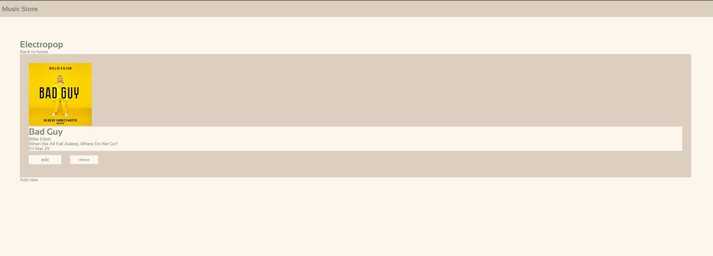

# Top Inventory Application

This is a practice exercise of a CRUD and a live postgres and also deployed backend using express js.



## Tech Stack

- express js
- postgres (neon)

## Prequist

for local

```
HOST=
USER=
DATABASE=
PASSWORD=
PORT=""

APP_PORT=
```

for producation

```
NODE_ENV=
DATABASE_URL="YOUR NEON CREDENTIALS"
```

## Get Start

```
npm install
node --watch app.js
```

## ENDPOINTS

| HTTP Request | Endpoint | Description |
| GET | "/" | returns all genre in the index page |
| GET | "/songs/:genre" | returns all the songs categorise by genre |
| GET | "/add-song/:genre" | gives a form to be field |
| POST | "/add-song/:genre" | add a new song |
| POST | "/delete-all" | delete all the songs in the database |
| GET | "/edit-song/:id/:genre" | retrieve the data of the song to be prepared to be edited |
| POST | "/edit-song/:id/:genre" | edit the song by id and its refered genre |
| POST | "/delete-song/:id/:genre" | delete the song by id |
